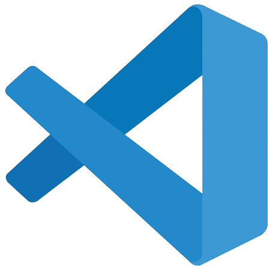
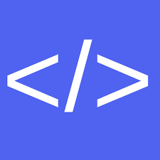

    

        <h1>Aula 00 - Introdução à Python</h1>
        

            Nesta aula, vamos dar os primeiros passos no mundo da programação com Python. Você vai conhecer a linguagem, entender por que ela é tão utilizada e começar a se familiarizar com seus principais conceitos e ferramentas.
        

        
         
        <h2>Por que Python?</h2>
        Em programação competitiva, não basta encontrar uma solução para um problema. É preciso encontrar uma solução correta, eficiente e rápida de implementar. Nesse contexto, a escolha da linguagem de programação pode fazer uma grande diferença.
         
         
        Python se destaca nesse cenário principalmente pela sua <strong>simplicidade e produtividade</strong>.
          
        Sua sintaxe enxuta permite transformar uma ideia em código com poucas linhas, fazendo com que o competidor possa concentrar seus esforços na resolução do problema em vez de se preocupar excessivamente com detalhes da linguagem.
         
         
        Por outro lado, Python também possui algumas limitações,
          
        principalmente relacionadas ao <strong>desempenho</strong>.
         
         
        Por ser uma linguagem interpretada e possuir um custo maior de execução em determinadas operações, algumas soluções que seriam tranquilamente executadas em C++ podem ultrapassar o limite de tempo quando implementadas da mesma forma em Python.
         
         
        Por isso, aprender Python para programação competitiva não significa apenas conhecer sua sintaxe. É importante entender <strong>onde a linguagem é eficiente, onde ela apresenta limitações e como escrever código que tire proveito de seus pontos fortes</strong>.
    

     
    

        <h2>Configuração do Ambiente</h2>
         
        Antes de começarmos a programar, precisamos preparar o nosso ambiente de desenvolvimento. Abaixo, você encontrará as instruções para verificar e instalar o Python no seu sistema operacional, além das opções de editores para escrever seus códigos.
         
         
        

        <h3>Windows</h3>
        

            Para verificar se você possui o Python instalado no Windows, abra o <strong>Prompt de Comando (cmd)</strong> ou o <strong>PowerShell</strong> e digite o comando <code>python --version</code>. Se a versão não for exibida, acesse o tutorial de instalação abaixo.
        

         
        
         
         
        <figcaption>
            Clique no ícone do Windows para abrir o tutorial de instalação do Python.
        </figcaption>
         
        

        <h3>Linux</h3>
        

            Para verificar se você possui o Python instalado no Linux, abra o seu <strong>Terminal (Ctrl + Alt + T)</strong> e digite o comando <code>python3 --version</code>. Caso a versão não seja mostrada, consulte o passo a passo no link a seguir.
        

         
        
         
         
        <figcaption>
            Clique no ícone do Linux para abrir o tutorial de instalação do Python.
        </figcaption>
         
        

        <h3>macOS</h3>
        

            Para verificar se você possui o Python instalado no macOS, abra o <strong>Terminal (Command + Espaço, digite "Terminal")</strong> e execute o comando <code>python3 --version</code>. Se necessário, veja o guia de instalação abaixo.
        

         
        
         
         
        <figcaption>
            Clique no ícone do macOS para abrir o tutorial de instalação do Python.
        </figcaption>
         
        

        <h3>VS Code</h3>
        Para escrever e executar código Python, você vai precisar de um editor de código.
         
         
        Recomendamos o uso do <strong>Visual Studio Code</strong> (VS Code), que é uma ferramenta gratuita e muito popular entre os programadores.
         
         
        
         
         
        <figcaption>
            Clique na imagem para ser redirecionado à página de download do VsCode.
        </figcaption>
         
        

        <h3>Google Colab</h3>
        Caso não tenha um computador à disposição no momento ou prefira não instalar programas, você pode utilizar o <strong>Google Colab</strong>. 
         
         
        
        <figcaption>
            Clique na imagem para ser redirecionado à página do Google Colab.
        </figcaption>
         
         
        Ele é um ambiente de desenvolvimento gratuito na nuvem que permite escrever e executar código Python direto pelo seu navegador, usando até mesmo seu celular ou tablet.
         
         
        

        <h3>One Compiler</h3>
        Caso não tenha um computador à disposição no momento ou prefira não instalar programas, você pode utilizar o <strong>One Compiler</strong>. 
         
         
        
         
         
        <figcaption>
            Clique na imagem para ser redirecionado à página do One Compiler.
        </figcaption>
         
         
        Ele é um ambiente de desenvolvimento gratuito na nuvem que permite escrever e executar código Python direto pelo seu navegador, usando até mesmo seu celular ou tablet.
         
         
        <h2>Alicerces da Programação Competitiva</h2>
        Agora que já temos nosso ambiente pronto, vamos aprender os primeiros blocos de construção do Python: como exibir dados na tela e ler informações enviadas pelo usuário. 
         
         
        Aproveitaremos o ensejo para falar um pouco sobre Programação Competitiva e como ela se difere da programação tradicional.
         
         
        

        <h3>Olá Mundo!</h3>
        Em programação competitiva, nossos programas geralmente não possuem interfaces gráficas, botões ou janelas para interagir com o usuário. A comunicação com o programa acontece principalmente por meio da <strong>entrada e saída padrão</strong>.
         
         
        A saída padrão, também conhecida como <em>standard output</em> ou <strong>stdout</strong>, é o local onde o programa envia as informações que deseja exibir. Em Python, uma das principais formas de realizar essa tarefa é utilizando a função <code>print()</code>.
         
         
        Vamos começar com o exemplo clássico de qualquer curso de programação:
         
         
        

<pre><code>print("Olá, Mundo!")</code></pre>

         
         
        Ao executar esse código, teremos como saída:
         
         
        

<pre><code>Olá, Mundo!</code></pre>

         
         
        Embora esse exemplo seja extremamente simples, a função <code>print()</code> será utilizada constantemente durante nossos estudos. Em programação competitiva, ela é especialmente importante porque é por meio dela que apresentamos a resposta produzida pelo nosso programa.
         
         
        É importante entender, porém, que a saída do programa não é apenas uma mensagem destinada a uma pessoa. Em uma competição, ela será analisada automaticamente por um <strong>juiz</strong>, que verifica se o resultado produzido pelo seu programa está de acordo com o esperado.
         
         
        Por isso, <strong>a formatação da saída é tão importante quanto o próprio resultado</strong>. Se o enunciado pede que o programa exiba determinado valor em um formato específico, devemos seguir exatamente o que foi solicitado.
         
         
        Por exemplo, suponha que um problema peça para imprimir apenas o número <code>42</code>. O código:
         
         
        

<pre><code>print(42)</code></pre>

         
        produz exatamente a saída esperada:
         
         
        

<pre><code>42</code></pre>

         
        Por outro lado, adicionar uma mensagem que não foi solicitada:
         
         
        

<pre><code>print("A resposta é:", 42)</code></pre>

         
        produzirá:
         
         
        

<pre><code>A resposta é: 42</code></pre>

         
        Apesar de uma pessoa conseguir entender facilmente que a resposta é <code>42</code>, essa saída pode ser considerada <strong>incorreta</strong> pelo sistema de correção, pois não corresponde ao formato especificado no problema.
         
         
        O mesmo cuidado deve ser tomado com <strong>espaços, quebras de linha e outros caracteres</strong>. Em programação competitiva, não devemos imprimir informações adicionais apenas para tornar o programa mais amigável ao usuário. Devemos imprimir exatamente aquilo que o enunciado solicitar.
         
         
        Regra de ouro: leia atentamente a seção de <strong>Saída</strong> do problema e produza exatamente o formato solicitado.
         
         
        Agora que entendemos o papel da saída padrão, vamos conhecer melhor a função <code>print()</code> e algumas formas de utilizá-la.
         
         
        A função <code>print()</code> possui diversos recursos que facilitam a montagem da resposta no formato exato exigido pelos problemas.
         
         
        <strong>1. Múltiplos valores e o parâmetro <code>sep</code></strong>
         
         
        Podemos passar vários valores para a função <code>print()</code> separados por vírgulas. Quando fazemos isso, o Python coloca um espaço em branco entre cada valor por padrão:
         
         
        

<pre><code>print("Python", "é", "legal")</code></pre>

         
        Saída:
         
         
        

<pre><code>Python é legal</code></pre>

         
         
        Podemos alterar esse comportamento utilizando o parâmetro <code>sep</code>, abreviação de <em>separator</em>. Ele define o que será colocado entre os valores:
         
         
        

<pre><code>print("2026", "08", "27", sep="-")</code></pre>

         
        Saída:
         
         
        

<pre><code>2026-08-27</code></pre>

         
         
        O separador pode ser qualquer texto que faça sentido para a saída que queremos produzir:
         
         
        

<pre><code>print("Python", "é", "legal", sep=" | ")</code></pre>

         
        Saída:
         
         
        

<pre><code>Python | é | legal</code></pre>

         
         
        <strong>2. Concatenação de strings</strong>
         
         
        Outra maneira de juntar textos é utilizando o operador de adição (<code>+</code>). Esse processo é chamado de <strong>concatenação</strong>.
         
         
        

<pre><code>print("Olá, " + "mundo!")</code></pre>

         
        Saída:
         
         
        

<pre><code>Olá, mundo!</code></pre>

         
         
        Diferentemente de passar vários valores separados por vírgulas, a concatenação não adiciona espaços automaticamente. O espaço precisa fazer parte de uma das strings:
         
         
        

<pre><code>print("Olá" + "mundo")
print("Olá" + " " + "mundo")</code></pre>

         
        Saída:
         
         
        

<pre><code>Olámundo
Olá mundo</code></pre>

         
         
        Essa diferença é importante: quando utilizamos vírgulas, estamos passando <strong>vários valores</strong> para <code>print()</code>. Quando utilizamos <code>+</code>, estamos <strong>juntando strings</strong> antes de exibi-las.
         
         
        <strong>3. O parâmetro <code>end</code></strong>
         
         
        Por padrão, cada chamada de <code>print()</code> termina com uma quebra de linha. É por isso que duas chamadas consecutivas aparecem em linhas diferentes:
         
         
        

<pre><code>print("Primeira linha")
print("Segunda linha")</code></pre>

         
        Saída:
         
         
        

<pre><code>Primeira linha
Segunda linha</code></pre>

         
         
        Podemos alterar o que será colocado ao final da saída utilizando o parâmetro <code>end</code>:
         
         
        

<pre><code>print("Primeira linha", end=" ")
print("Segunda linha")</code></pre>

         
        Saída:
         
         
        

<pre><code>Primeira linha Segunda linha</code></pre>

         
         
        Enquanto <code>sep</code> controla o que aparece <strong>entre os valores</strong> de uma mesma chamada de <code>print()</code>, <code>end</code> controla o que aparece <strong>ao final da chamada</strong>.
         
         
        <strong>4. Caracteres especiais</strong>
         
         
        Também podemos utilizar caracteres especiais dentro das strings para controlar a formatação do texto. Um dos mais importantes é <code>\n</code>, que representa uma quebra de linha:
         
         
        

<pre><code>print("Primeira linha\nSegunda linha")</code></pre>

         
        Saída:
         
         
        

<pre><code>Primeira linha
Segunda linha</code></pre>

         
         
        Outro caractere bastante utilizado é <code>\t</code>, que representa uma tabulação:
         
         
        

<pre><code>print("Nome:\tJoão")
print("Idade:\t25")</code></pre>

         
        Saída:
         
         
        

<pre><code>Nome:	 João
Idade:	 25</code></pre>

         
         
        Esses caracteres são especialmente úteis quando precisamos produzir uma saída com uma formatação específica.
         
         
        <strong>5. Interpolação de textos com f-strings</strong>
         
         
        Até agora, vimos como exibir textos e valores separadamente ou como juntar strings utilizando o operador <code>+</code>. Porém, em programas reais, é muito comum precisarmos construir uma mensagem utilizando valores que foram calculados ou armazenados durante a execução.
         
         
        Para isso, uma das formas mais práticas em Python é utilizar as chamadas <strong>f-strings</strong>. Basta colocar a letra <code>f</code> antes das aspas e escrever os valores ou expressões dentro de chaves (<code>{}</code>):
         
         
        

<pre><code>print(f"O resultado é {40 + 2}")</code></pre>

         
        Saída:
         
         
        

<pre><code>O resultado é 42</code></pre>

         
         
        O verdadeiro potencial das f-strings aparece quando queremos inserir valores armazenados em variáveis:
         
         
        

<pre><code>nome = "João"
idade = 25

print(f"Meu nome é {nome} e tenho {idade} anos.")</code></pre>

         
        Saída:
         
         
        

<pre><code>Meu nome é João e tenho 25 anos.</code></pre>

         
         
        Veremos o funcionamento das variáveis com mais detalhes na próxima aula. Por enquanto, basta entender que as f-strings permitem misturar <strong>texto e valores</strong> de maneira simples e legível.
         
         
        <strong>6. Caracteres Unicode</strong>
         
         
        Python também permite utilizar diretamente caracteres de diferentes idiomas, acentos e diversos símbolos dentro das strings:
         
         
        

<pre><code>print("Água, pão e maçã")
print("Símbolos: ★ 🧮")</code></pre>

         
        Saída:
         
         
        

<pre><code>Água, pão e maçã
Símbolos: ★ 🧮</code></pre>

         
        Isso é possível graças ao suporte a <strong>Unicode</strong>, que permite representar uma grande variedade de caracteres e símbolos em textos.
         
         
        

         
        Agora que já sabemos como exibir informações e formatar nossas saídas, estamos prontos para entender como capturar informações do usuário.
         
         
        <h3>Entrada Padrão e a função <code>input()</code></h3>
        Em programação competitiva, nossos programas precisam receber dados para que possam processá-los e produzir uma resposta. Esses dados são fornecidos por meio da <strong>entrada padrão</strong>, também conhecida como <em>standard input</em> ou <strong>stdin</strong>.
         
         
        Podemos visualizar o funcionamento básico de um programa como:
         
         
        

<pre><code>Entrada → Processamento → Saída</code></pre>

         
         
        Já conhecemos a última etapa desse processo. Agora vamos aprender como obter os dados da entrada e utilizá-los durante a execução do nosso programa.
         
         
        Em Python, a principal função para ler dados da entrada padrão é a <code>input()</code>. O seu funcionamento mais básico é:
         
         
        

<pre><code>entrada = input()
print(entrada)</code></pre>

         
         
        Ao encontrar <code>input()</code>, o programa lê uma linha completa da entrada padrão e armazena o valor recebido em uma <strong>variável</strong> chamada <code>entrada</code> <a href="../01%20-%20Vari%C3%A1veis%20e%20Tipos/Vari%C3%A1veis%20e%20Tipos.md" title="Aula 01 — Variáveis e Tipos">📖</a>. Em seguida, o <code>print()</code> exibe esse valor na saída.
         
         
        Em um ambiente interativo, quem digita esse valor é o próprio usuário. Em programação competitiva, porém, essa entrada normalmente é fornecida automaticamente pelo sistema de testes — sem que ninguém precise digitar nada.
         
         
        <strong>1. <code>input()</code> sempre retorna uma <a href="../01%20-%20Vari%C3%A1veis%20e%20Tipos/Vari%C3%A1veis%20e%20Tipos.md" title="Aula 01 — Variáveis e Tipos">string</a></strong>
         
         
        Um detalhe fundamental é que <code>input()</code> <strong>sempre</strong> retorna o valor recebido como uma <strong><a href="../01%20-%20Vari%C3%A1veis%20e%20Tipos/Vari%C3%A1veis%20e%20Tipos.md" title="Aula 01 — Variáveis e Tipos">string</a></strong>, independentemente do que foi digitado. Isso é verdade mesmo quando a entrada representa um número.
         
         
        Por exemplo, se a entrada for:
         
         
        

<pre><code>25</code></pre>

         
        e executarmos:
         
         
        

<pre><code>idade = input()
print(type(idade))</code></pre>

         
         
        teremos como saída:
         
         
        

<pre><code>&lt;class 'str'&gt;</code></pre>

         
         
        Ou seja, o valor armazenado em <code>idade</code> é o texto <code>"25"</code>, e <strong>não</strong> o número inteiro <code>25</code>. Veremos a diferença entre <strong>tipos de dados</strong> com muito mais profundidade na <a href="../01%20-%20Vari%C3%A1veis%20e%20Tipos/Vari%C3%A1veis%20e%20Tipos.md">Aula 01 — Variáveis e Tipos</a>.
         
         
        Essa diferença é importante porque strings e números possuem comportamentos distintos. Observe o que acontece quando tentamos "somar" dois valores lidos com <code>input()</code>:
         
         
        

<pre><code>a = input()
b = input()

print(a + b)</code></pre>

         
         
        Se a entrada for:
         
         
        

<pre><code>10
20</code></pre>

         
         
        a saída será:
         
         
        

<pre><code>1020</code></pre>

         
         
        Isso acontece porque <code>a</code> e <code>b</code> são strings, e o operador <code>+</code> sobre strings realiza uma <strong>concatenação</strong> de textos — e não uma soma matemática. Para realizar operações numéricas, precisamos converter os valores.
         
         
        

            <strong>Atenção:</strong> sempre que você receber um número pela entrada e precisar utilizá-lo em cálculos, lembre-se de convertê-lo para o tipo adequado. Esquecer essa conversão é um dos erros mais comuns para quem está começando.
        

         
        <strong>2. Convertendo a entrada para números</strong>
         
         
        Quando precisamos realizar operações matemáticas, devemos converter a string recebida para um <strong>tipo numérico</strong> <a href="../01%20-%20Vari%C3%A1veis%20e%20Tipos/Vari%C3%A1veis%20e%20Tipos.md" title="Aula 01 — Variáveis e Tipos">📖</a>. Para isso, Python oferece duas funções principais:
         
         
        Para <strong>números inteiros</strong>, utilizamos a função <code>int()</code>:
         
         
        

<pre><code>idade = int(input())
print(idade + 1)</code></pre>

         
         
        Se a entrada for:
         
         
        

<pre><code>25</code></pre>

         
         
        a saída será:
         
         
        

<pre><code>26</code></pre>

         
         
        Nesse caso, <code>input()</code> primeiro lê o valor como string e, em seguida, <code>int()</code> converte essa string para um número inteiro. Podemos visualizar o processo da seguinte maneira:
         
         
        

<pre><code>input() → "25" → int() → 25</code></pre>

         
         
        Para <strong>números com parte decimal</strong>, utilizamos a função <code>float()</code>:
         
         
        

<pre><code>altura = float(input())
print(altura * 2)</code></pre>

         
         
        Se a entrada for:
         
         
        

<pre><code>1.75</code></pre>

         
         
        a saída será:
         
         
        

<pre><code>3.5</code></pre>

         
         
        A conversão adequada depende sempre do <a href="../01%20-%20Vari%C3%A1veis%20e%20Tipos/Vari%C3%A1veis%20e%20Tipos.md">tipo de dado</a> que o problema fornece e do que precisamos fazer com ele durante o processamento.
         
         
        <strong>3. Lendo vários valores na mesma linha</strong>
         
         
        É muito comum que um problema forneça vários valores em uma mesma linha. Por exemplo:
         
         
        

<pre><code>10 20</code></pre>

         
         
        Nesse caso, uma única chamada de <code>input()</code> lê a linha inteira como uma string. A variável <code>entrada</code> conterá o texto <code>"10 20"</code>:
         
         
        

<pre><code>entrada = input()
print(entrada)</code></pre>

         
         
        Para separar esses valores, podemos utilizar o método <code>split()</code>, que divide a string nos espaços em branco e retorna uma <strong>lista</strong> com cada pedaço <a href="../03%20-%20La%C3%A7os%20e%20Matrizes/La%C3%A7os%20e%20Matrizes.md" title="Aula 03 — Laços e Matrizes">📖</a>:
         
         
        

<pre><code>entrada = input().split()
print(entrada)</code></pre>

         
         
        Com a entrada:
         
         
        

<pre><code>10 20</code></pre>

         
         
        teremos:
         
         
        

<pre><code>['10', '20']</code></pre>

         
         
        Observe que os valores resultantes ainda são strings. Quando precisamos utilizá-los como números, podemos combinar o <code>split()</code> com a função <code>map()</code> <a href="../03%20-%20La%C3%A7os%20e%20Matrizes/La%C3%A7os%20e%20Matrizes.md" title="Aula 03 — Laços e Matrizes">📖</a>, que aplica uma conversão a cada elemento da lista:
         
         
        

<pre><code>a, b = map(int, input().split())
print(a + b)</code></pre>

         
         
        Com a entrada:
         
         
        

<pre><code>10 20</code></pre>

         
         
        teremos como saída:
         
         
        

<pre><code>30</code></pre>

         
         
        Essa construção — <code>a, b = map(int, input().split())</code> — é extremamente comum em programação competitiva e permite ler vários números de uma mesma linha de forma direta e eficiente. Vale guardá-la na memória. O funcionamento detalhado de <code>map()</code> e funções de ordem superior será explorado na <a href="../03%20-%20La%C3%A7os%20e%20Matrizes/La%C3%A7os%20e%20Matrizes.md">Aula 03 — Laços e Matrizes</a>.
         
         
        <strong>4. Entrada e saída trabalhando juntas</strong>
         
         
        Agora podemos juntar os conceitos apresentados nesta aula. Considere um problema que fornece dois números inteiros em uma mesma linha e pede que seja impressa a soma entre eles.
         
         
        Se a entrada for:
         
         
        

<pre><code>15 27</code></pre>

         
         
        podemos resolver o problema com:
         
         
        

<pre><code>a, b = map(int, input().split())
print(a + b)</code></pre>

         
         
        A execução pode ser entendida em três etapas:
         
         
        

<pre><code>Entrada → 15 27
           ↓
Processamento → 15 + 27
           ↓
Saída → 42</code></pre>

         
         
        Essa é a estrutura por trás de grande parte dos problemas de programação competitiva: <strong>ler os dados, processá-los e produzir exatamente a saída solicitada</strong>.
         
         
        

         
         
        <h2>Conhecendo o Python</h2>
        Ao longo desta aula, você utilizou a função <code>print()</code> para exibir informações, a função <code>input()</code> para receber dados e converteu valores entre diferentes tipos numéricos. Com esses recursos, já é possível escrever programas que leem uma entrada, realizam um processamento e produzem uma saída.
         
         
        Antes de avançarmos, vale a pena dar um passo atrás e entender um pouco melhor a linguagem que estamos utilizando.
         
         
        

        <h3>O que é Python?</h3>
        Python é uma linguagem de programação de <strong>alto nível</strong> e de <strong>propósito geral</strong>. Isso significa que ela foi projetada para ser utilizada em uma grande variedade de contextos: automação de tarefas, desenvolvimento web, ciência de dados, inteligência artificial, scripts e, claro, programação competitiva.
         
         
        No contexto deste curso, o que mais nos interessa em Python é uma combinação de três características: <strong>simplicidade</strong>, <strong>legibilidade</strong> e <strong>produtividade</strong>. Em uma competição, onde o tempo é um recurso valioso, conseguir transformar uma ideia em código funcional de maneira rápida e com poucas linhas faz toda a diferença.
         
         
        

        <h3>Como um programa Python é executado?</h3>
        Python é uma linguagem tradicionalmente classificada como <strong>interpretada</strong>. De maneira simplificada, isso significa que o código que escrevemos é processado pelo <strong>interpretador Python</strong> durante a execução do programa.
         
         
        Podemos representar esse processo assim:
         
         
        

<pre><code>Código Python → Interpretador Python → Execução</code></pre>

         
         
        Essa é uma simplificação que nos ajuda a construir um modelo mental sobre o que acontece quando executamos um programa. O ponto importante é perceber que <strong>o código não é executado diretamente pela máquina</strong>: ele precisa ser processado pelo interpretador para que suas instruções sejam realizadas.
         
         
        

        <h3>Fluxo de execução</h3>
        Um detalhe importante sobre como os programas funcionam é que <strong>nem toda instrução escrita no código necessariamente será executada</strong>. Dependendo da estrutura do programa, determinadas instruções podem ser puladas ou nunca alcançadas.
         
         
        Esse conceito ficará muito mais claro quando estudarmos condicionais, laços de repetição e funções. Por ora, vamos observar um exemplo simples:
         
         
        

<pre><code>print("Início")

if False:
    numero = 10 / 0

print("Fim")</code></pre>

         
         
        A saída desse programa é:
         
         
        

<pre><code>Início
Fim</code></pre>

         
         
        Uma divisão por zero normalmente provocaria um erro durante a execução. Porém, a instrução <code>numero = 10 / 0</code> está dentro de um bloco que <strong>não foi executado</strong>, pois a condição era <code>False</code>. Como essa instrução nunca entrou no fluxo de execução, o erro associado a ela também não ocorreu.
         
         
        Agora observe o mesmo programa com a condição invertida:
         
         
        

<pre><code>print("Início")

if True:
    numero = 10 / 0

print("Fim")</code></pre>

         
         
        Nesse caso, o bloco <strong>será executado</strong>, a divisão por zero ocorrerá e o programa encerrará com um erro. A instrução <code>print("Fim")</code> nunca chegará a ser executada.
         
         
        A mensagem principal desses dois exemplos é: <strong>uma instrução escrita no código não necessariamente será executada</strong>, e os problemas causados por uma instrução só aparecem quando ela efetivamente entra no fluxo de execução.
         
         
        

            <strong>Atenção — erros de sintaxe são diferentes.</strong> Mesmo que um trecho de código esteja dentro de um bloco que nunca seria executado, se ele contiver um erro de sintaxe, o programa não chegará a iniciar. Por exemplo:
             
             
            

<pre><code>if False:
    print("Olá"</code></pre>

             
            O parêntese não fechado é um erro de sintaxe. Independentemente da condição ser <code>False</code>, o Python precisa analisar a estrutura do código antes de executar qualquer coisa — e ao encontrar esse problema, interrompe tudo antes mesmo de começar.
        

         
        

        <h3>Três tipos de problemas em um programa</h3>
        À medida que você escreve mais código, inevitavelmente encontrará situações em que o programa não se comporta como esperado. Esses problemas podem ser classificados em três categorias:
         
         
        <strong>1. Erros de sintaxe</strong>
         
         
        Acontecem quando o código não segue as regras da linguagem. O interpretador não consegue nem iniciar a execução. São os mais fáceis de identificar, pois o próprio Python indica onde o problema está.
         
         
        

<pre><code>print("Olá"   # parêntese não fechado</code></pre>

         
         
        <strong>2. Erros de execução</strong>
         
         
        Acontecem enquanto o programa está sendo executado e encontra uma situação problemática. O código é sintaticamente válido, mas algo dá errado durante a execução — como tentar dividir um número por zero ou acessar um dado que não existe.
         
         
        

<pre><code>numero = 10 / 0   # ZeroDivisionError</code></pre>

         
         
        <strong>3. Erros lógicos</strong>
         
         
        São os mais sutis e, em programação competitiva, os mais importantes de conhecer. O programa executa até o final sem apresentar nenhuma mensagem de erro — mas produz um resultado incorreto.
         
         
        

<pre><code>a, b = map(int, input().split())
print(a - b)   # deveria ser a + b</code></pre>

         
         
        Para a entrada <code>10 20</code>, o programa exibirá <code>-10</code> em vez de <code>30</code>. Nenhum erro será sinalizado, mas a resposta está errada.
         
         
        

            Em programação competitiva, erros lógicos são especialmente críticos porque o juiz automático compara a saída do seu programa com a resposta esperada. Um programa que executa sem erros e ainda assim produz a resposta errada será rejeitado. Por isso, não basta o programa <em>rodar</em>: ele precisa produzir <strong>exatamente</strong> a saída correta para todas as entradas previstas pelo problema.
        

         
        

        <h3>Características do Python</h3>
        Agora que temos uma ideia de como os programas são executados, vale destacar brevemente algumas características da linguagem que serão relevantes ao longo do curso.
         
         
        <strong>Alto nível</strong>
         
         
        Python permite que o programador trabalhe com conceitos próximos do problema que deseja resolver, sem precisar lidar diretamente com muitos detalhes de baixo nível, como gerenciamento manual de memória.
         
         
        <strong>Sintaxe simples e enxuta</strong>
         
         
        Python foi projetado para ser legível. Em programação competitiva, isso significa que escrever menos código pode tornar a implementação de uma ideia mais rápida e reduzir a quantidade de detalhes a gerenciar durante uma competição.
         
         
        <strong>Tipagem dinâmica</strong>
         
         
        Você já teve contato com tipos ao converter valores com <code>int()</code> e <code>float()</code>. Python permite que uma variável receba valores de tipos diferentes durante a execução:
         
         
        

<pre><code>x = 10
x = "Olá"</code></pre>

         
         
        Esse comportamento é chamado de <strong>tipagem dinâmica</strong>. Variáveis e tipos serão estudados com muito mais profundidade na <a href="../01%20-%20Vari%C3%A1veis%20e%20Tipos/Vari%C3%A1veis%20e%20Tipos.md">Aula 01 — Variáveis e Tipos</a>.
         
         
        <strong>Multiplataforma</strong>
         
         
        Python pode ser utilizado em diferentes sistemas operacionais — Windows, Linux e macOS — sem que seja necessário adaptar o código para cada plataforma.
         
         
        <strong>Biblioteca padrão ampla</strong>
         
         
        Python vem acompanhado de uma grande coleção de módulos prontos para uso, com funcionalidades que vão desde operações matemáticas até manipulação de arquivos. Ao longo do curso, utilizaremos alguns desses módulos para resolver problemas de forma mais eficiente.
         
         
        <strong>Desempenho</strong>
         
         
        A simplicidade do Python tem um custo. Quando comparado a linguagens como C++, Python pode ser significativamente mais lento em certas operações. Em programação competitiva, isso é relevante: soluções que seriam suficientemente rápidas em C++ podem ultrapassar o limite de tempo quando implementadas de forma inadequada em Python.
         
         
        Isso não torna Python uma má escolha — mas é necessário conhecer essa limitação e aprender a escrever soluções que a levem em consideração. Esse será um tema recorrente ao longo do curso.
         
         
        

        <h3>Fechamento</h3>
        Ao longo desta aula, você deu os primeiros passos na programação com Python. Conheceu a entrada e a saída padrão, utilizou <code>print()</code> e <code>input()</code>, aprendeu a converter tipos e escreveu seus primeiros programas. Agora entende também que esses programas seguem um <strong>fluxo de execução</strong> processado pelo interpretador Python.
         
         
        A ideia central por trás de qualquer programa pode ser resumida assim:
         
         
        

<pre><code>Entrada → Processamento → Saída</code></pre>

         
         
        Durante o curso, você aprenderá diversas estruturas e ferramentas para controlar o que acontece na etapa de <strong>processamento</strong> — desde decisões simples até algoritmos complexos.
         
         
        

            O Python executa nosso programa seguindo um fluxo de execução. Entender esse fluxo será fundamental para compreender condicionais, laços, funções e, principalmente, para descobrir por que uma solução produz determinado resultado.
        

         
         
    

