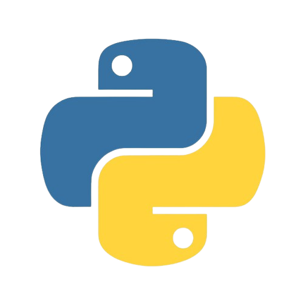

<h1>Aula 04 - Laços de Repetição</h1>

Nesta aula, vamos introduzir o conceito de repetição. Você descobrirá que um computador é excelente em executar a mesma operação muitas vezes, e que estruturas de repetição permitem expressar isso de forma compacta e controlada.

 
<h2>O Problema da Repetição</h2>
Até agora, nossos programas executaram comandos de cima para baixo, uma única vez. Imagine que precisamos resolver um problema muito simples: imprimir os números de 1 a 5.
 
 
Com o que sabemos, poderíamos escrever:
 
 

<pre><code>print(1)
print(2)
print(3)
print(4)
print(5)</code></pre>

 
Esse programa funciona. O problema não é que a solução esteja errada, o problema é que ela não <strong>escala</strong>.
 
 
E se quiséssemos imprimir os números de 1 até 100? E se fossem de 1 até 1.000.000? Pior ainda: e se o número final viesse da entrada, fornecido pelo usuário, e não soubéssemos qual é enquanto programamos?
 
 
Escrever cada instrução manualmente seria impraticável. Se olharmos com atenção, existe uma repetição clara nesse problema. Em vez de escrever <code>print(...)</code> dezenas de vezes, queremos ensinar o computador a: <em>"repita a operação de imprimir o próximo número"</em>.
 
 

<h2>A Ideia de um Laço</h2>
Uma repetição, também chamada de <strong>laço</strong> (ou <em>loop</em>), possui algumas características fundamentais:
 
 
<ul>
<li>Uma <strong>ação</strong> que será repetida;</li>
<li>Alguma <strong>informação</strong> que muda entre as repetições (por exemplo, o número que será impresso);</li>
<li>Uma <strong>regra</strong> que determina quando continuar;</li>
<li>Uma <strong>condição</strong> que determina quando parar.</li>
</ul>
 
Conceitualmente, o computador trabalha assim:
 
 

<pre><code>Repetição 1
→ executa a ação

Repetição 2
→ executa a ação

Repetição 3
→ executa a ação
...</code></pre>

 
O computador simplesmente executa o mesmo bloco de código novamente. Cada execução desse bloco é chamada de <strong>iteração</strong>. Agora precisamos aprender a dizer ao Python como essa repetição deve acontecer.
 
 

<h2>While</h2>
A primeira estrutura de repetição que vamos conhecer é o <code>while</code>. Em português, "while" significa "enquanto". A ideia dele é: <em>enquanto uma condição for verdadeira, execute este bloco</em>.
 
 
Veja como resolvemos o problema de imprimir os números de 1 a 5:
 
 

<pre><code>contador = 1

while contador &lt;= 5:
    print(contador)
    contador += 1</code></pre>

 
Antes de analisarmos linha por linha, leia esse código em linguagem natural:
 
 
<em>"Enquanto contador for menor ou igual a 5: mostre contador; depois aumente contador em 1."</em>
 
 
Essa leitura é a melhor maneira de interpretar um <code>while</code>. Vamos entender cada parte:
 
 
<ul>
<li><code>contador = 1</code>: é a preparação antes do laço começar.</li>
<li><code>while contador &lt;= 5:</code>: é a condição que será verificada. Note os dois pontos (<code>:</code>) no final, que indicam que um bloco de código vai começar.</li>
<li><code>print(contador)</code>: é uma das ações repetidas. Repare que ela possui um recuo à esquerda (indentação).</li>
<li><code>contador += 1</code>: faz o programa avançar, também indentado.</li>
</ul>
 
A indentação não é apenas visual no Python. É ela que diz ao computador que essas duas linhas pertencem ao bloco do <code>while</code> e devem ser repetidas.
 
 
<h3>Execução Passo a Passo</h3>
Não basta apenas ler o código. Vamos ver o que o Python realmente faz durante a execução. O <code>while</code> não "sabe" previamente que serão cinco repetições. Ele continua porque a condição permanece verdadeira.
 
 
<table border="1" style="width: 100%; text-align: center; border-collapse: collapse;">
<tr><th>Valor de contador</th><th>Condição <code>contador &lt;= 5</code></th><th>O que acontece</th></tr>
<tr><td>1</td><td>True</td><td>Imprime 1 → contador vira 2</td></tr>
<tr><td>2</td><td>True</td><td>Imprime 2 → contador vira 3</td></tr>
<tr><td>3</td><td>True</td><td>Imprime 3 → contador vira 4</td></tr>
<tr><td>4</td><td>True</td><td>Imprime 4 → contador vira 5</td></tr>
<tr><td>5</td><td>True</td><td>Imprime 5 → contador vira 6</td></tr>
<tr><td>6</td><td>False</td><td>Laço termina</td></tr>
</table>
 
A condição é verificada <strong>novamente</strong> depois de cada execução completa do bloco. Quando a condição se torna falsa (no caso, quando chega em 6), ele para e o programa continua nas linhas que não estão indentadas.
 
 

<h2>Contador e Atualização</h2>
Vamos aprofundar o papel das linhas <code>contador = 1</code> e <code>contador += 1</code>.
 
 
A variável <code>contador</code> acompanha o progresso da repetição. A primeira linha define o <strong>ponto de partida</strong>. A linha <code>contador += 1</code> faz o contador avançar. Como vimos na aula sobre operadores de atribuição, isso é apenas uma forma abreviada de escrever <code>contador = contador + 1</code>.
 
 
Esse padrão não depende apenas dos números 1 e 5. Veja esta variação:
 
 

<pre><code>contador = 3

while contador &lt;= 7:
    print(contador)
    contador += 1</code></pre>

 
A lógica é exatamente a mesma: o ponto de partida agora é 3 e ele repete enquanto for menor ou igual a 7.
 
 

<h2>Condição de Parada</h2>
Um laço precisa ter uma maneira de chegar ao fim. No nosso exemplo original:
 
 

<pre><code>while contador &lt;= 5:</code></pre>

 
A repetição continua enquanto a condição for verdadeira. Quando <code>contador</code> passa a valer 6, a expressão <code>contador &lt;= 5</code> se torna falsa. Portanto, o laço termina.
 
 
Visualmente, a ideia é:
 
 

<pre><code>condição verdadeira → continua
condição falsa → para</code></pre>

 
Essa mudança não acontece "automaticamente". Alguma variável usada na condição precisa mudar dentro do laço de maneira que permita que a condição eventualmente deixe de ser verdadeira.
 
 

<h2>Loop Infinito</h2>
O que acontece se esquecermos de atualizar o nosso contador?
 
 

<pre><code>contador = 1

while contador &lt;= 5:
    print(contador)</code></pre>

 
O que está faltando? O <code>contador += 1</code>. 
 
 
Sem ele, <code>contador</code> nunca é alterado e continua valendo 1 para sempre. Consequentemente, a condição <code>contador &lt;= 5</code> continua verdadeira para sempre. O programa ficará imprimindo o número 1 sem parar.
 
 
Isso é conhecido como um <strong>loop infinito</strong>. Como regra prática: <em>"Se a condição do while depende de uma variável, precisamos prestar atenção em como essa variável muda dentro do laço."</em> O uso de um contador mudando a cada iteração é um padrão extremamente comum.
 
 

<h2>While com Quantidade Determinada por Entrada</h2>
Lembra que perguntamos como faríamos se o número final viesse do usuário? O <code>while</code> resolve isso perfeitamente, pois não precisamos saber a quantidade de repetições enquanto escrevemos o programa.
 
 

<pre><code>n = int(input())

contador = 1
while contador &lt;= n:
    print(contador)
    contador += 1</code></pre>

 
O usuário fornece <code>n</code>. O programa não sabe antecipadamente qual será esse valor. Se <code>n</code> for 5, serão cinco repetições. Se <code>n</code> for 20, serão vinte.
 
 
Isso demonstra uma das grandes vantagens dos laços, que conectamos diretamente ao modelo das nossas primeiras aulas:
 
 

<pre><code>Entrada:
n

Processamento:
repetir a impressão enquanto contador &lt;= n

Saída:
os números de 1 até n</code></pre>

 

<h2>For</h2>
Existe uma situação na programação que acontece com tanta frequência que o Python criou uma estrutura especialmente para ela: <em>"Quero executar uma ação para cada valor de uma sequência."</em>
 
 
Para esses casos, usamos o <code>for</code>. Veja a solução do nosso problema inicial (imprimir de 1 a 5) usando o <code>for</code>:
 
 

<pre><code>for i in range(1, 6):
    print(i)</code></pre>

 
Lendo em português, temos: <em>"Para cada valor de 1 até 5, execute o bloco."</em>
 
 
Na sintaxe, <code>for i in ...</code> significa que a variável <code>i</code> receberá, uma de cada vez, as informações produzidas pela sequência. 
 
 
O comando <code>range(1, 6)</code> produz os valores: 1, 2, 3, 4, 5. Então, a execução ocorre assim:
 
 

<pre><code>i = 1 → executa
i = 2 → executa
...
i = 5 → executa</code></pre>

 
Quando não há mais valores na sequência, o <code>for</code> termina.
 
 
<h3>Comparação Imediata</h3>
Ambos os códigos abaixo produzem a mesma saída (1 a 5):
 
 

<pre><code># Usando while
contador = 1
while contador &lt;= 5:
    print(contador)
    contador += 1

# Usando for
for contador in range(1, 6):
    print(contador)</code></pre>

 
Eles resolvem o mesmo problema, mas expressam ideias diferentes.
 
 
No <code>while</code>, a ideia é: <em>"continue enquanto a condição for verdadeira."</em>
 
No <code>for</code>, a ideia é: <em>"para cada valor da sequência, execute."</em>
 
 
O <code>for</code> não é simplesmente "um while mais fácil". Eles são estruturas diferentes, cada uma brilhando mais em determinadas situações.
 
 

<h2>Range()</h2>
O <code>range()</code> é uma ferramenta que você utilizará constantemente junto com o <code>for</code>. Ele serve para gerar sequências de números e possui três formatos diferentes. Vamos entendê-los na ordem.
 
 
O primeiro formato recebe apenas o limite final:
 
 

<pre><code>for i in range(5):
    print(i)</code></pre>

 
Isso produzirá os números 0, 1, 2, 3, 4. 
 
Note que <strong>o início padrão é 0</strong> e <strong>o limite final não é incluído</strong>.
 
 
O segundo formato recebe início e fim:
 
 

<pre><code>for i in range(1, 6):
    print(i)</code></pre>

 
Isso produz 1, 2, 3, 4, 5. Ele começa no 1 e para antes do 6, avançando de 1 em 1.
 
 
O terceiro formato recebe <strong>início, fim e passo</strong>:
 
 

<pre><code>for i in range(1, 10, 2):
    print(i)</code></pre>

 
Isso produz 1, 3, 5, 7, 9. O terceiro argumento determina os "saltos". 
 
 
A regra mental principal para o <code>range()</code> que você deve levar é: <em>"começa em início, vai até antes de fim, avançando de passo em passo."</em>
 
 

<h2>Contagem Regressiva</h2>
E se quisermos contar de trás para frente? O <code>passo</code> do <code>range()</code> também pode ser negativo.
 
 

<pre><code>for i in range(5, 0, -1):
    print(i)</code></pre>

 
Isso mostrará: 5, 4, 3, 2, 1.
 
 
<ul>
<li><code>5</code> → é o início.</li>
<li><code>0</code> → é o limite final, que não é incluído.</li>
<li><code>-1</code> → é o passo, que nos faz andar uma unidade para trás.</li>
</ul>
 

<strong>Observação importante:</strong> Como o <code>range(5, 0, -1)</code> não inclui o limite final 0, se quisermos que o 0 apareça na tela, precisamos recuar o limite para uma unidade antes. Portanto, faríamos <code>range(5, -1, -1)</code> para incluir o zero no processamento.

 

<h2>For Percorrendo uma String</h2>
O <code>for</code> não serve apenas para números gerados pelo <code>range()</code>. Ele pode percorrer outros tipos de sequências, como por exemplo, um texto (string).
 
 

<pre><code>palavra = "Python"

for caractere in palavra:
    print(caractere)</code></pre>

 
A cada iteração, a variável <code>caractere</code> receberá uma letra da palavra. A execução será:
 
 

<pre><code>1ª iteração → 'P'
2ª iteração → 'y'
3ª iteração → 't'
...</code></pre>

 
Esse é o poder do <code>for</code>: ele entende naturalmente a ideia geral de "percorrer uma sequência".
 
 

<h2>Contadores</h2>
No início da aula, usamos a variável <code>contador</code> para controlar a quantidade de repetições do <code>while</code>. Porém, podemos usar a mesma ideia de contador para responder a uma pergunta muito valiosa nos algoritmos: <em>"Quantas vezes algo aconteceu?"</em>.
 
 
Imagine que queremos descobrir quantos números pares existem entre 1 e 10.
 
 

<pre><code>quantidade = 0

for i in range(1, 11):
    if i % 2 == 0:
        quantidade += 1

print(quantidade)</code></pre>

 
Acompanhe o raciocínio: a variável <code>quantidade</code> começa em 0. O laço percorre os números e, cada vez que o <code>if</code> detecta que um número é par, o nosso contador aumenta uma unidade (<code>quantidade += 1</code>). Ao final do laço, a variável contém o número exato de casos encontrados.
 
 
Note a diferença fundamental: o <code>i</code> é a variável usada para percorrer os valores da sequência. A <code>quantidade</code> é a variável que criamos para acumular ativamente <strong>quantos</strong> casos encontramos que nos interessam.
 
 

<h2>Acumuladores</h2>
Muito parecidos com os contadores, os acumuladores também acompanham o progresso de um laço, mas com uma diferença essencial: enquanto o contador geralmente aumenta de 1 em 1 para registrar uma quantidade de ocorrências, o acumulador <strong>mantém um valor que vai sendo construído</strong> ao longo das repetições.
 
 
Se quisermos somar todos os números de 1 até 5:
 
 

<pre><code>soma = 0

for i in range(1, 6):
    soma += i

print(soma)</code></pre>

 
A evolução da variável <code>soma</code> fica assim:
 
 
<ul>
<li><strong>início:</strong> <code>soma = 0</code></li>
<li><strong>depois de processar 1:</strong> <code>soma = 1</code></li>
<li><strong>depois de processar 2:</strong> <code>soma = 3</code></li>
<li><strong>depois de processar 3:</strong> <code>soma = 6</code></li>
<li><strong>depois de processar 4:</strong> <code>soma = 10</code></li>
<li><strong>depois de processar 5:</strong> <code>soma = 15</code></li>
</ul>
 

Tanto contadores quanto acumuladores <strong>precisam ser inicializados antes do laço</strong> começar (ex: <code>soma = 0</code>), caso contrário, o Python não saberá a partir de que valor começar a adicionar.

 

<h2>Break</h2>
Às vezes não queremos apenas esperar a condição normal do laço terminar. Queremos <strong>interromper</strong> a repetição imediatamente quando alguma situação específica acontecer.
 
 
Para isso, usamos o comando <code>break</code>.
 
 

<pre><code>for i in range(1, 11):
    if i == 6:
        break
    print(i)</code></pre>

 
O laço foi programado para ir até 10. Ele imprime 1, 2, 3, 4 e 5. Mas quando <code>i</code> chega a 6, o <code>if</code> é ativado e o <code>break</code> é executado. 
 
 
Neste exato momento, o <code>break</code> <strong>encerra o laço em que está inserido</strong> completamente. Ele não significa "pule esta iteração", ele mata o laço na mesma hora.
 
 

<h2>Continue</h2>
Diferente do <code>break</code>, que mata o laço inteiro, o <code>continue</code> serve para <strong>encerrar apenas a iteração atual e seguir para a próxima</strong>.
 
 

<pre><code>for i in range(1, 6):
    if i == 3:
        continue
    print(i)</code></pre>

 
O resultado na tela será: 1, 2, 4, 5.
 
 
Quando <code>i</code> vale 3, o <code>continue</code> faz o programa ignorar o restante daquela iteração (o <code>print(i)</code> não acontece para o 3). Mas o laço em si continua vivo puxando o próximo valor.
 
 
Para reforçar a ideia:
 
 
<table border="1" style="width: 100%; text-align: left; border-collapse: collapse;">
<tr><th>Comando</th><th>O que faz</th></tr>
<tr><td><code>break</code></td><td>→ Encerra o laço completamente.</td></tr>
<tr><td><code>continue</code></td><td>→ Encerra apenas a iteração atual e segue para a próxima.</td></tr>
</table>
 
 

<h2>While versus For</h2>
Agora que você conhece os dois laços de repetição, quando usar qual? A escolha deve ser guiada pela estrutura do problema, e não pela ideia de que um é "mais poderoso" que o outro.
 
 
Use <code>for</code> quando o problema naturalmente descrever: <em>"para cada valor de uma sequência..."</em> ou <em>"processe todos os números de 1 a n."</em>.
 
 
Use <code>while</code> quando o problema naturalmente descrever: <em>"enquanto esta condição for verdadeira..."</em> ou <em>"continue lendo ou processando enquanto uma condição não for satisfeita."</em>
 
 

<h2>Problemas de Programação Competitiva</h2>
Laços aparecem constantemente porque problemas de competição frequentemente exigem processar vários valores, repetir cálculos, contar ocorrências ou somar dados. Vamos ver isso na prática.
 
 
<strong>Problema 1: Imprimir números de 1 até N</strong>
 
Enunciado: Dado um número N, imprima todos os números de 1 até N.
 
<em>O que precisa acontecer várias vezes? A impressão. Precisamos saber previamente quantas vezes vamos repetir? Sim, N vezes, o que nos convida a usar for + range().</em>
 
 

<pre><code># Entrada
n = int(input())

# Processamento
for i in range(1, n + 1):
    # Saída
    print(i)</code></pre>

 
<strong>Problema 2: Somar números de 1 até N</strong>
 
Enunciado: Qual a soma total de todos os números de 1 a N?
 
<em>Estamos contando alguma coisa ou acumulando algum valor? Acumulando. Precisamos de um acumulador!</em>
 
 

<pre><code># Entrada
n = int(input())

# Processamento
soma = 0
for i in range(1, n + 1):
    soma += i

# Saída
print(soma)</code></pre>

 
<strong>Problema 3: Contar quantos números pares existem entre 1 e N</strong>
 
Enunciado: Conte quantos números do intervalo de 1 a N são divisíveis por 2.
 
<em>Qual variável controla a repetição? O range(). O que muda a cada iteração é que verificamos o contador de pares através de uma condição.</em>
 
 

<pre><code>n = int(input())
pares = 0

for i in range(1, n + 1):
    if i % 2 == 0:
        pares += 1

print(pares)</code></pre>

 
<strong>Problema 4: Calcular uma soma a partir de vários valores informados</strong>
 
Enunciado: O primeiro número N diz quantas idades você lerá. Depois, você lerá as N idades (uma por linha). Calcule a soma delas.
 
<em>O que precisa ser repetido? A leitura do input! Vamos fazer uma repetição controlada e usar um acumulador.</em>
 
 

<pre><code>n = int(input())
soma_idades = 0

for _ in range(n):
    idade = int(input())
    soma_idades += idade

print(soma_idades)</code></pre>

 
<strong>Problema 5: Interromper o processamento</strong>
 
Enunciado: Imprima os números da sequência de 1 a 100, mas pare imediatamente se chegar em um número que seja divisível por 13.
 
<em>Precisamos parar antes de terminar a sequência? Sim. Logo, o uso do break é obrigatório.</em>
 
 

<pre><code>for i in range(1, 101):
    if i % 13 == 0:
        break
    print(i)</code></pre>

 
<strong>Problema 6: Ignorar determinados elementos</strong>
 
Enunciado: Imprima a sequência de 1 a 10, mas pule o número 5.
 
<em>Ao invés de parar de vez, apenas pulamos o elemento atual com o continue.</em>
 
 

<pre><code>for i in range(1, 11):
    if i == 5:
        continue
    print(i)</code></pre>

 
Decompor problemas te permite não depender da memorização de padrões de código!
 
 

<h2>Erros Comuns</h2>
Separamos aqui alguns dos tropeços mais comuns durante o aprendizado inicial sobre laços.
 
 
<strong>ERRO 1: Esquecer os dois pontos (<code>:</code>)</strong>
 

<pre><code>while contador &lt;= 5
    print(contador)</code></pre>

 
Isso gera um erro de sintaxe. O Python depende dos dois pontos para saber quando a condição termina e quando o bloco inicia.
 
 
<strong>ERRO 2: Esquecer a indentação</strong>
 

<pre><code>while contador &lt;= 5:
print(contador)</code></pre>

 
O bloco de repetição precisa obrigatoriamente estar recuado (indentado) à direita para o interpretador compreendê-lo como parte do laço.
 
 
<strong>ERRO 3: Esquecer de atualizar a variável no <code>while</code></strong>
 

<pre><code>contador = 1
while contador &lt;= 5:
    print(contador)</code></pre>

 
Esquecer da atualização causará um loop infinito, pois o laço continuará verificando uma condição que sempre permanecerá inalterada e verdadeira.
 
 
<strong>ERRO 4: Interpretar incorretamente o limite do <code>range()</code></strong>
 

<pre><code>for i in range(1, 5):
    print(i)</code></pre>

 
Muitos acham que o 5 será incluído, mas o Python interrompe a sequência no valor anterior (neste caso, o 4).
 
 
<strong>ERRO 5: Confundir <code>break</code> e <code>continue</code></strong>
 
Lembre-se da nossa comparação: o <code>break</code> destrói o laço imediatamente inteiro, enquanto o <code>continue</code> ignora apenas a execução atual e puxa a próxima.
 
 
<strong>ERRO 6: Esquecer de inicializar um contador ou acumulador</strong>
 

<pre><code>for i in range(5):
    soma += i</code></pre>

 
Sem um valor inicial (como <code>soma = 0</code>), a instrução <code>soma += i</code> tentará somar um número a uma variável que sequer existe ainda.
 
 

<h2>Resumo da Aula</h2>
Hoje você viu que:
 
 
<ol>
<li><strong>Laços</strong> permitem repetir operações de forma eficiente e estruturada no nosso processamento.</li>
<li>O <strong><code>while</code></strong> repete a ação enquanto uma condição for verdadeira.</li>
<li>Um <strong><code>while</code></strong> precisa de uma evolução que permita que a condição eventualmente deixe de ser verdadeira quando essa for a intenção, para não travar num loop infinito.</li>
<li>O <strong><code>for</code></strong> percorre organizadamente os valores de uma sequência inteira.</li>
<li>O <strong><code>range()</code></strong> é usado frequentemente para gerar sequências de números para iterarmos.</li>
<li>O <strong>limite final do <code>range()</code> não é incluído</strong> na iteração.</li>
<li><strong>Contadores</strong> registram ativamente quantidades (quantas ocorrências ocorreram).</li>
<li><strong>Acumuladores</strong> constroem valores continuamente ao longo das repetições (ex: qual o total ou saldo).</li>
<li><strong><code>break</code></strong> encerra completamente o laço.</li>
<li><strong><code>continue</code></strong> pula apenas a iteração atual.</li>
<li>A <strong>escolha entre <code>for</code> e <code>while</code></strong> depende exclusivamente da estrutura descritiva do problema, não há escolha certa universal.</li>
</ol>
 
Antes de escrever qualquer laço de repetição, utilize isso como uma checklist mental e se pergunte:
 
 
<ul>
<li>O que precisa ser repetido?</li>
<li>Quantas vezes?</li>
<li>Como eu sei quando parar?</li>
<li>Qual variável precisa mudar para essa parada acontecer?</li>
<li>Estou contando alguma coisa, ou acumulando um valor geral?</li>
<li>Preciso interromper antes do final se alguma regra for quebrada?</li>
</ul>
 
Diferenciar essas respostas te guiará naturalmente na construção correta da Entrada → Processamento → Saída nas competições!
 
 

